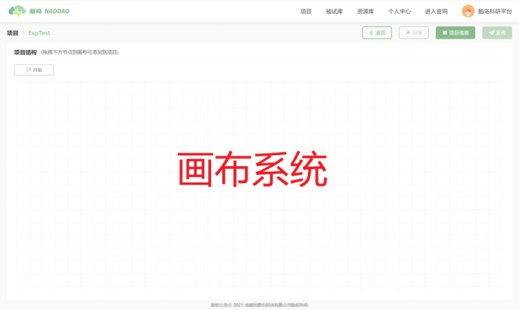
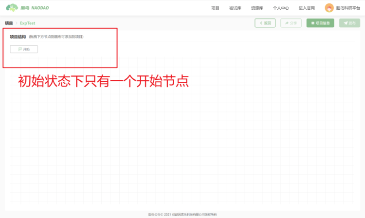
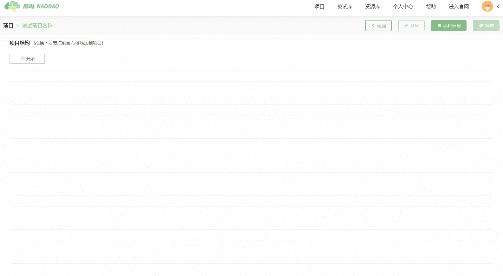
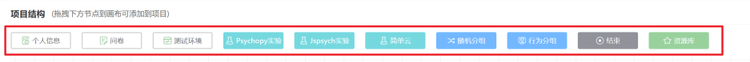
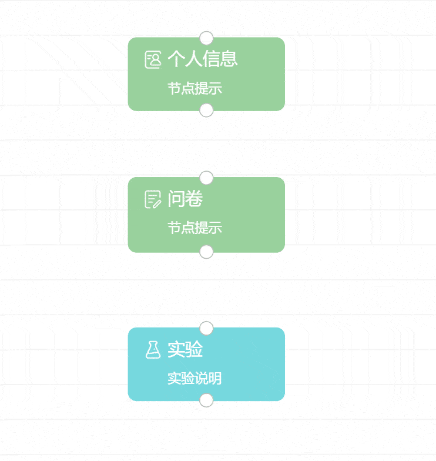

# 画布和节点

脑岛研究者平台希望您在脑岛中所做的一切都可以通过一个清晰且直观的界面来展现，因此脑岛提供了一套简单易用但又功能强大的画布工具，您可通过画布工具轻松快速地编辑自己的项目和实验，并且只需通过鼠标拖动即可设计复杂的项目流程。

在初始未激活状态下，【画布】的菜单栏中仅有一个【开始】节点。

您需要将【开始】节点拖入【画布】才能激活画布的编辑状态。

在编辑状态下，画布的菜单栏会显示若干功能节点，您可通过将这些功能节点拖动到画布中以实现复杂的项目结构。

画布中所有的功能节点均通过*鼠标点击按中并拖动* 这一动作进入画布。功能节点之间通过连接线进行相连。

## 目前可使用的节点一览 <!-- {docsify-ignore} -->

* 功能控制节点

    ○ 开始节点

    ○ 结束节点

* 问卷类型节点

    ○ 问卷节点

    ○ 个人信息（预设的一套用于收集个人信息的问卷）

    ○ 测试环境（预设的一套用于收集被试作答环境的问卷）

* 实验类型节点

    ○ 简单云节点

    ○ PsychoPy 节点

    ○ jsPsych 节点

* 分组器节点

    ○ 随机分组节点

    ○ 行为分组节点

* 资源库节点
