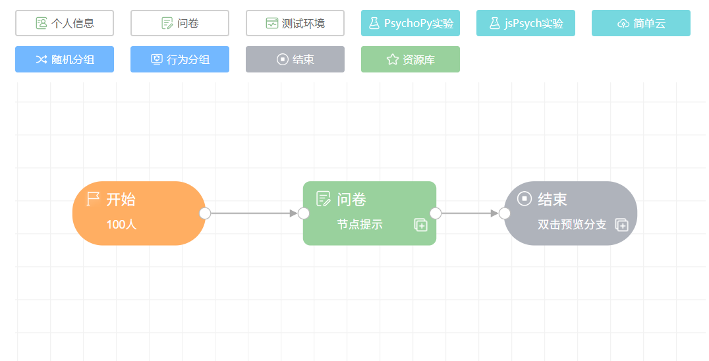

## 从零开始创建项目 <!-- {docsify-ignore-all} -->

一个脑岛的项目包括了如下要素：

### 项目信息

项目本身的一些属性，包括项目名称、项目描述、项目人数等。

### 项目内容

在一个项目中，[画布和节点](project1-2.md#画布和节点) 是项目的核心内容。每一种节点承载了对应的功能或内容，例如实验、问卷等；而画布用于排列、组织节点。通过在画布上连接各种节点，研究者可以实现灵活地编排研究内容。

## 项目发布信息

完成项目的编辑之后可以进行[项目的发布](project1-3.md#发布项目)。发布就是将项目分发给被试（测试者）的过程。

脑岛提供了 2 种发布渠道：平台发布和匿名发布。

* 平台发布会将项目发布在脑岛平台首页 (https://www.naodao.com)。研究者通过脑岛发放被试费用，并可以利用脑岛提供的[被试库](participants.md)等功能，对接收人群进行更精确的选择
* 匿名发布后脑岛仅提供一个匿名链接，研究者需要自行将链接分发给被试。脑岛平台不参与匿名发布项目的分发、信息收集、测试费结算等环节

无论选择哪种发布渠道，被试完成项目产生的数据都会**储存在脑岛**。