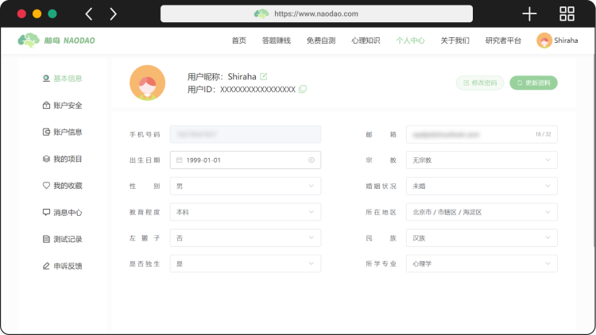
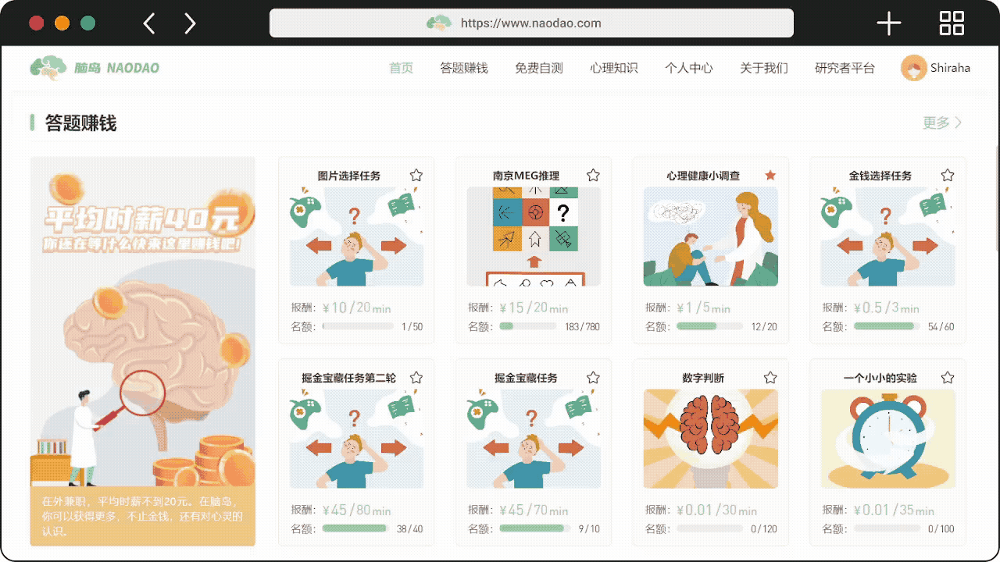
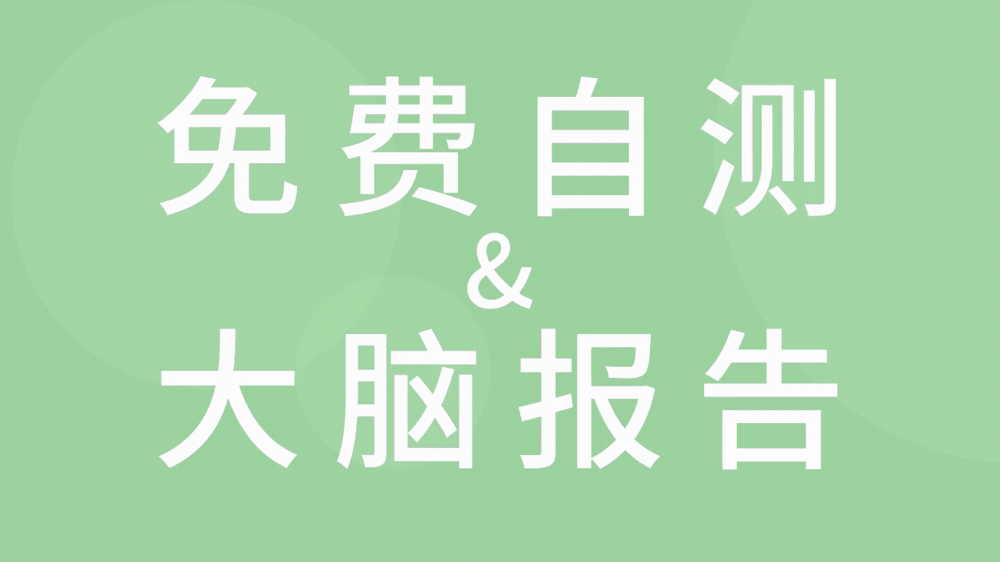

# 在脑岛，大脑健身了解一下？

今年夏天似乎不同往年地格外炎热，进行户外运动请务必做好防护。在不宜外出运动、游玩的时候，宅家也是不错的选择。不过，你有没有想过足不出户，也能来一次大脑健身？朋友，脑岛平台了解一下不？

脑岛平台是普通大众与科研人员交汇的地方。而对于我们而言，脑岛是个闲暇时间赚点零花钱，顺便为科学研究做出贡献的地方；不仅如此，使用脑岛还能测测自己的心理状态，看看心理学知识等等。这种好事还不火速安排？接下来我们一起看看这样的脑岛要如何使用吧。

## 从注册开始

使用手机号即可登录注册，关注脑岛公众号，快捷登录，直接提现到微信等便利功能。

注册后请完善个人中心的基本信息，不然很多功能是无法使用的哦～

说到脑岛的功能，脑岛平台最核心的功能，那必须是项目！我们能在脑岛的各个地方看见项目的身影。

脑岛的项目又分为两个版块，即「答题赚钱」和「免费自测」。

## 答题赚钱

从多个入口找到答题赚钱的项目。所有项目都明码标价*童叟无欺*。这些提供丰厚报酬的项目，全部是由来自全国各地的科研人员（在脑岛被称为「研究者」）发布的，因此也会存在较大变动，看见感兴趣的可要先下手为强，不要让机会溜走了。

点击进入一个项目，阅读并同意《知情同意书》后就可以继续作答了。

项目的内容和难度存在一定的差异，有的项目主要内容可能是问卷，按照实际情况填写即可；有的可能是实验，考验眼力脑力难如考驾照；还有的两者兼具。但每一个项目一定都是经过设计的，报酬通常也与时间成正比。按照真实情况作答是最好的，不是必须要追求满分。

这里我们演示一下作答实验的流程。需要注意实验在浏览器弹出的标签页进行，完成实验后如果没有自动关闭，则需要手段关闭标签页。

在完成了整个项目后，发布项目的研究者会对你的结果进行审查。审查通过后就能得到对应的报酬啦！

研究者为什么要在脑岛撒钱 币 呢？这其实是一种共赢的模式，研究者能通过脑岛收集到想要的数据，而我们也能拿到报酬，更长远的意义上还能推动科学进步！因此在脑岛大可放心地薅研究者的这份「羊毛」（🐑：听我说，谢谢你）

不过研究者也有自己的科研目的，无论是研究者还是平台，一定都希望我们的作答是认真、负责的，这样才能吸引更多的研究者，有更多的项目项目供我们选择。因此答应我好吗，作答之前一定仔细阅读说明、保证作答质量，可不能变成所到之处寸草不生的那类羊毛党。对于心术不正的羊毛党，平台也会有相应措施降下制裁。

获得的报酬会存入账户的余额，到达指定金额可以提现。看，接下来就是激动人心的时刻……

## 免费自测

你还在沉迷 MBTI？心理学家看了直摇头。市面上有太多不靠谱的测试，借着模棱两可的描述和专业的营销手段大行其道，心理学测试更是其中的重灾区。可惜的是，专业可靠的心理学知识往往无人问津。

我们相信严谨与有趣绝对不冲突，这就是免费自测想要做的。脑岛背后的科研团队都是心理学背景的高校研究员，在保证专业性的大前提下，会持续挑选生动有趣的测评进入免费自测。

每次完成免费自测的测试以后，将为这次测试生成一份「大脑报告」，通常包含了分数及相应的解读。我们可以在个人中心 — 测试记录内回顾历次作答，分析自己的得分曲线，或者将得分分享给朋友甚至医生。

最重要的是，这一切都是免费的！

## 心理知识

心理学科普同样是脑岛的目标之一。在信息庞杂，难辨真伪的这个时代，保证专业性，拒绝伪科学是脑岛坚持的科普原则。心理知识版块均为专业的心理学研究者之手写作或筛选的精品内容。相信无论是初学心理学的小白，还是对心理学感兴趣的大众，都能从这里获得可靠、专业的科普知识。

在脑岛，人人都是心理学家。未来的心理学家，要不要现在加入我们？
