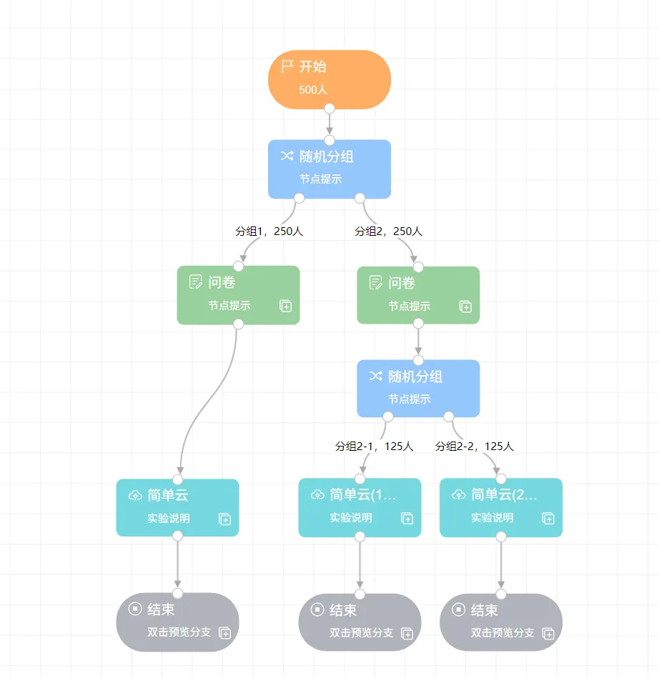
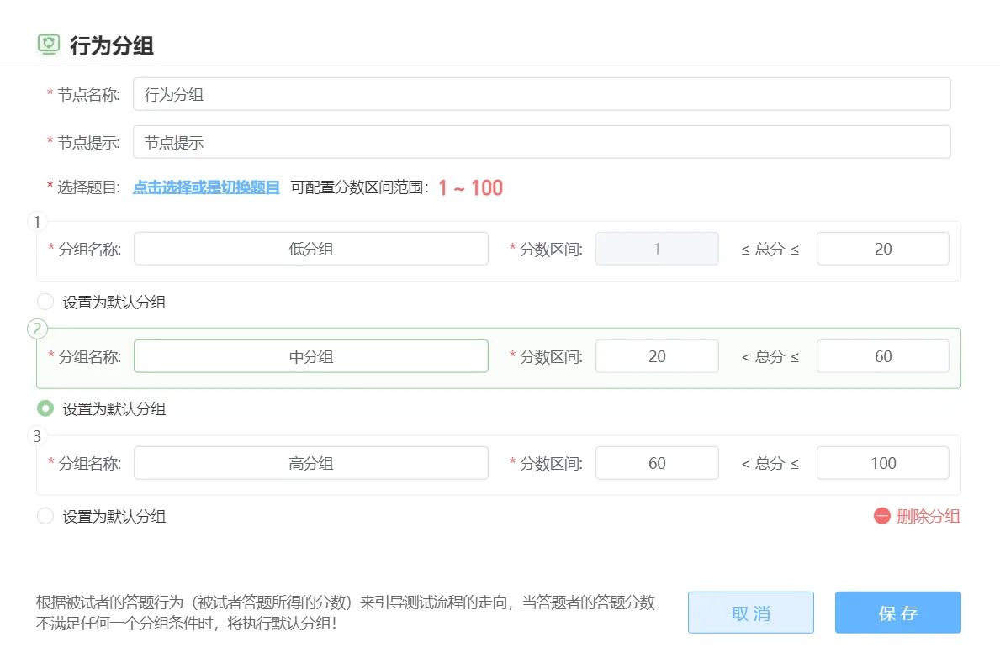

# 项目、画布和节点

## Q：画布是什么，画布包含哪些内容？  
  A：画布是项目的核心功能。一开始，您需要拖入开始节点，随后就像完成一个流程图一样，通过创建节点和连线就能直观地完成实验设计。双击画布上的节点会进入对应的内容编辑或功能页面。您可以参考使用手册的[画布与节点](/2-researcher-manual/1-1-2-Canvas-and-nodes.md)。 

## Q：如何在画布上实现被试间设计？  
  A：可以利用画布的「分组器节点」实现设定被试作答中的不同走向，在画布上体现为不同的组别（分支）。分组器节点包含「随机分组」和「行为分组」。 

## Q: 通过分组节点产生的多个分支该如何聚拢呢？  
  A: 画布目前只支持树状结构排列节点，无法聚拢。可以使用节点复制功能快速创建多个相同的结束节点，并安排在不同分组下。这样的好处是双击结束节点预览的必定是对应的分支，不受预览中作答的影响 

## Q: 行为分组该如何使用？  
  A: 行为分组会获取分组器的前一个节点的**得分**，根据设置好的区间决定被试被分在哪一个分支。当被试的得分没有落在任何区间时会被分到默认分支。问卷节点的得分需要在题目中设置，只有个别题型可以设置分值；实验节点需要使用 Python 脚本解析实验数据并返回得分数值。详情参见[行为分组](/2-researcher-manual/1-1-2-8-behavior-grouping.md)。 
  

## Q: 脑岛目前是否支持同时「行为分组」和「随机分组」？  
  A: 可以同时使用，但行为分组之后的分支无法使用随机分组。这是因为行为分组是根据被试上一个节点被试的得分进行分组，因而每组的人数是不确定的；而随机分组的上游需要固定人数，以便分配为每一组的人数。 

## Q: 那么应该如何实现「行为分组」后随机安排实验呢？  
  A: 可以认为此时需求的随机对于每组的比例（或人数）没有硬性要求，也即完全随机可以满足。因此可以尝试在实验内实现随机呈现实验 block 以达到对应的需求。

## Q：PsychoPy / jsPsych 节点上传实验压缩包失败或卡在 95% 处。  
  A：请确保您的压缩包
  - 体积小于 100 MB；
  - 没有数量非常多的子目录或和文件；
  - 包含且仅包含一个 html 文件（`index.html`） 