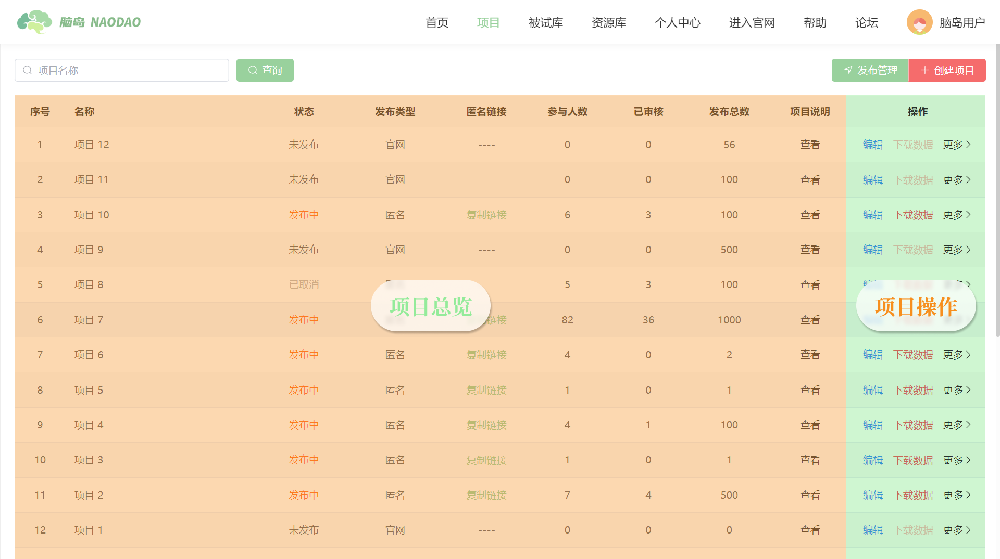
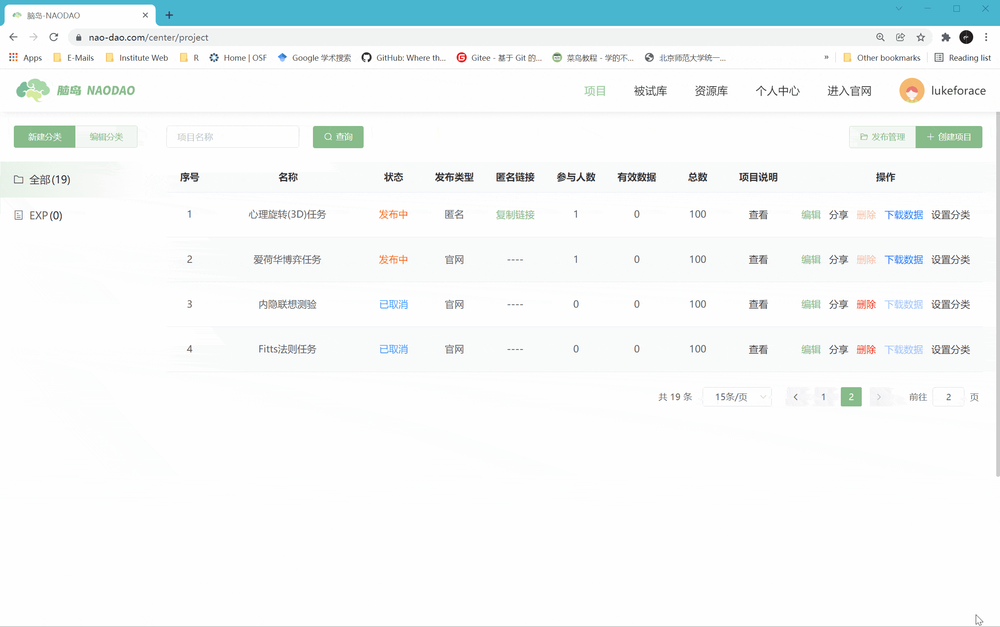
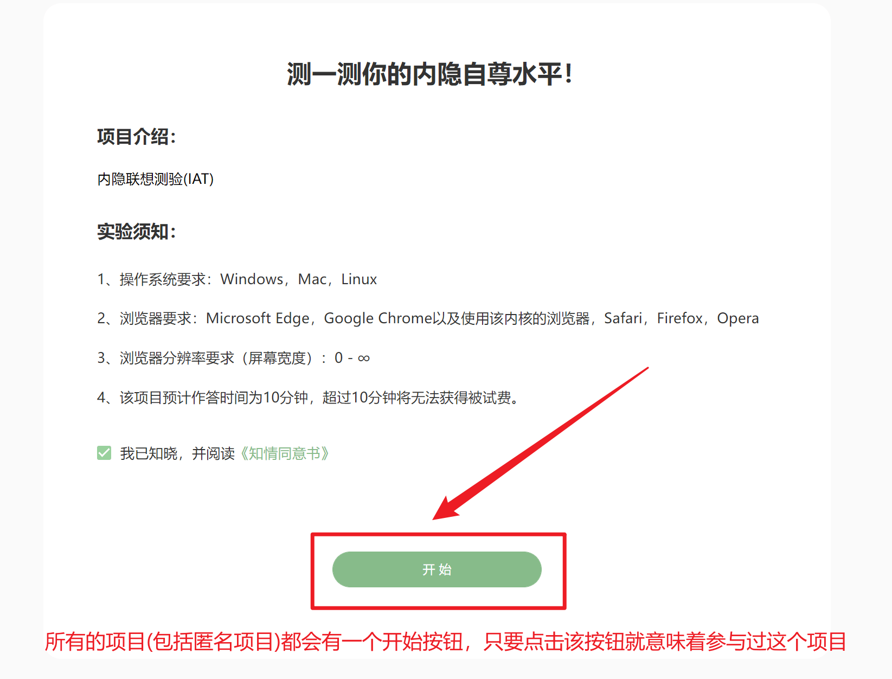
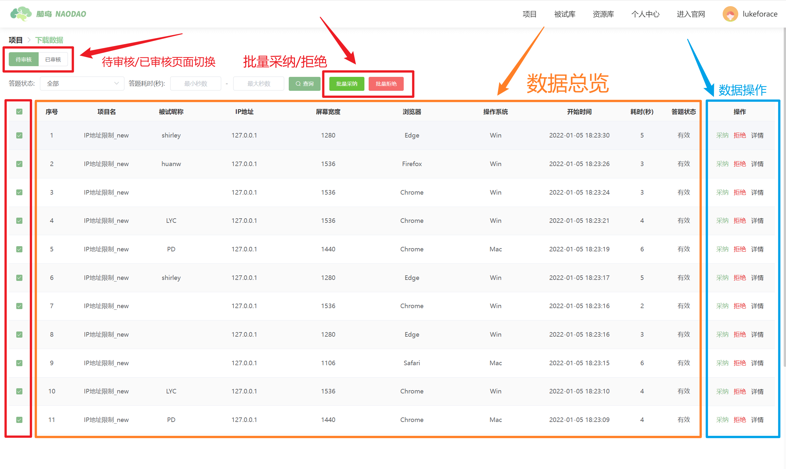
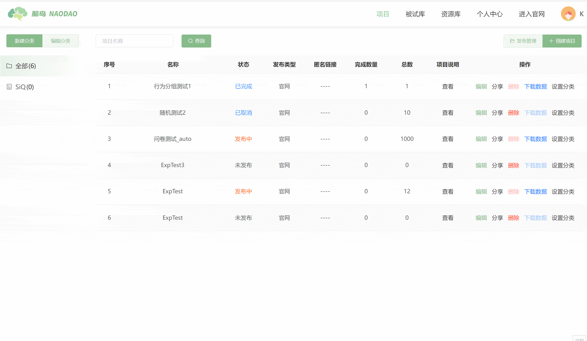
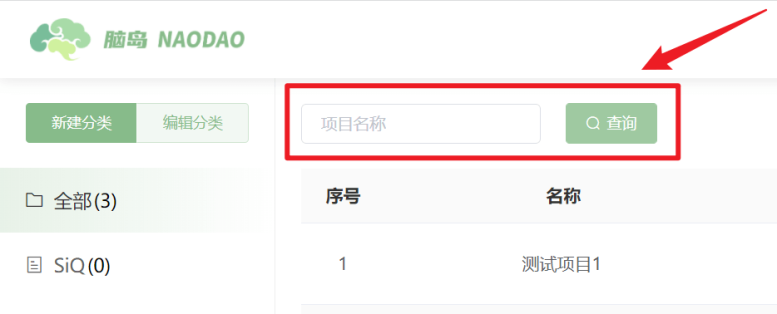
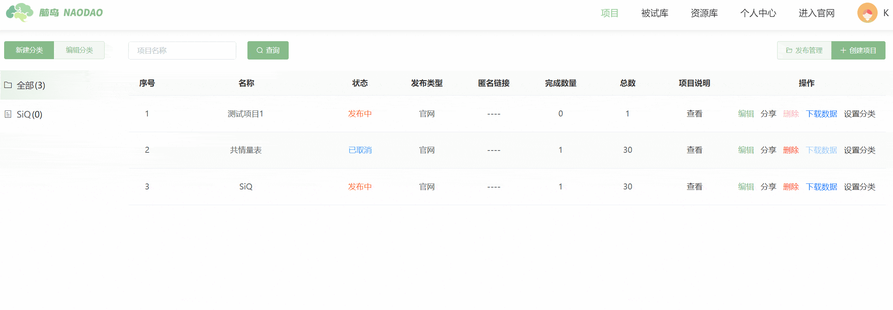

## 项目管理 <!-- {docsify-ignore-all} -->
在项目界面可以对已有的项目进行管理。

## 项目总览
### 名称

如您所见，就是您在创建项目时设置的**项目名称**。

### 状态
| 项目状态 | 状态说明 |
| :---: | :--- |
| 未发布 | 处于编辑状态中，尚未发布的项目 |
| 发布中 | 已经发布的项目 |
| 已完成 | 项目已收集到预期的数据，项目结束 |
| 已取消 | 研究者主动取消了已经发布的项目 |

### 发布类型
| 发布类型 | 发布类型说明 |
| :---: | :--- |
| 官网 | 项目发布在脑岛官网的答题赚钱版本，所有脑岛用户均可见 |
| 匿名 | 匿名发布，只会生成匿名链接，除发布者外其他用户不可见 |

### 匿名链接

只有匿名发布的项目才会生成一个对应的匿名链接，您可以点击【复制链接】按钮获取属于特定匿名项目的项目链接。您可以将该链接发给指定的被试，被试在浏览器中打开该链接即可开始作答。

### 参与人数

一个项目的**参与人数**是指，所有**进入过该项目**的被试总人数。

这个指标的统计标准是非常宽泛的，任何点击该项目的**开始**按钮的被试都被认为是参与过该项目。因此您可以想到的是，并非所有的参与者都会完整地做完项目且正常提交数据，同时也不是所有正常提交数据的参与者都是认真地作答题目。所以一个项目的**参与人数**总是大于或等于一个项目的**有效数量**。

### 有效数量

一个项目的**有效数量**是指，被采纳的数据记录的数量。当项目的**有效数量**等于项目的**总数**时，系统就会判定项目已完成。

> 【脑岛Tips】尽管我们希望一个项目的**有效数量**等同于**参与人数**，也就意味着每一个参与项目的被试都能认真作答且作答数据没有被研究者拒绝。但实际上这种情况是很少的，总是会存在一些被试中途退出导致没有数据或没有认真作答导致数据质量很差的情况。因此一个项目的**参与人数**大于**有效数量**是一件非常正常的事情。
>

### 总数

一个项目的**总数**就是您在发布项目时设置的**发布数量**

### 项目说明

即您在创建项目时设置的**项目介绍**

## 项目操作

### 编辑

点击【编辑】按钮进入画布，可对项目进行再次编辑。需要说明的是，【状态】为**已发布**和**已取消**的项目不能再次进行编辑，即进入此类项目的画布后无法进行任何修改。

### 分享

点击【分享】按钮可将该项目中的节点分享至个人或平台资源库，以及分享给指定研究员。

> 【脑岛Tips】项目分享功能暂不支持分享整个项目，目前只能分享节点。
>

### 删除

点击【删除】按钮可删除某个项目。【状态】为**发布中**的项目无法删除，同时只要某个项目存在一条作答记录也无法删除。

> 【脑岛Tips】脑岛暂不支持**回收站**功能，因此项目一旦删除就无法恢复，请慎重！
>

### 下载数据

您可以点击【下载数据】按钮进入项目数据下载页面。

### 设置分类

您可点击【设置分类】按钮将项目分类到不同的组别。

## 项目分类
### 新建分类

您可通过【新建分类】按钮创建新的项目分类。

### 编辑分类
  
您可通过【编辑分类】按钮对创建的分类进行**重命名**和**删除**。

## 查询项目

您可在【查询】左侧的文本框中输入**项目名称**，并通过【查询】按钮查找特定的项目。

## 其他教程
[脑岛使用小妙招16丨教你轻松掌握项目管理](https://mp.weixin.qq.com/s/jjS1J3uVRkWS71wRosSdRw)

[项目管理_哔哩哔哩_bilibili](https://www.bilibili.com/video/BV1g14y147ZT?p=17)

