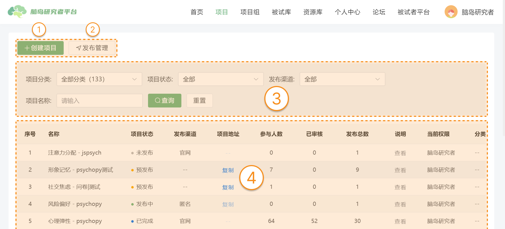

# 项目 <!-- {docsify-ignore-all} -->

在脑岛平台，研究者的研究都是通过「项目」承载的。研究的具体内容，例如问卷、实验等，都包含在项目中。项目由研究者**编辑**、**发布**，由被试者**作答**、**获得报酬**等。

用户可点击导航栏上的【项目】按钮进入项目版块。

项目版块的初始页面如下，**用户可以在【项目】页面进行以下操作**：

1. 【创建项目】：用户可以通过此功能新建研究项目并进行编辑发布。
2. 【发布管理】：用户可以通过此功能管理项目的发布状态，例如取消发布和查看已发布的信息。
3. 【筛选项目】：用户可通过项目分类、状态和名称来检索特定的项目。
4. 【项目看板】：用户可以在项目页面的中心看板区域总览自己所有的项目。

