# 简单云基本功能介绍

## 实验全局设置

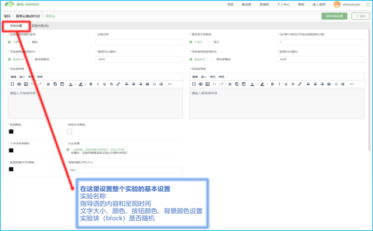

## 实验内容（块）

实验内容（块）这部分是设置实验的核心部分。点击【添加实验块】，即增加一个实验块（block）。如果您的实验有两个 block，则点击两次【添加实验块】。

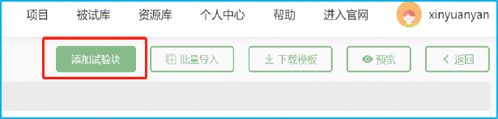

添加完实验块之后，请您设置这个实验块的基本信息。

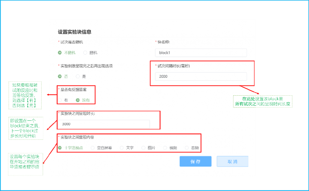

## 设置每个实验块（block）的实验试次信息

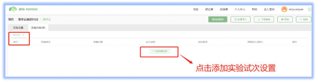

### 刺激类型设置

刺激类型包括文字、图片、视频和音频。

#### 文字

若为文字，则在红框处输入文字。

#### 图片

若为图片，则添加图片，并设置图片排列方式，以及设置图片的宽度和高度。

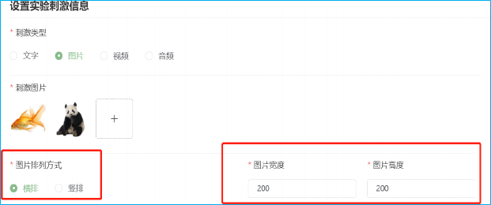

#### 视频

若为视频，则上传视频，并设置视频的宽度和高度。请注意！视频只能是 MP4 格式！

#### 音频

若为音频，则上传音频，MP3 格式。

### 试次之间呈现的内容和时间、答题时长

### 按键类型

#### 按钮

#### 键盘

#### 滑块

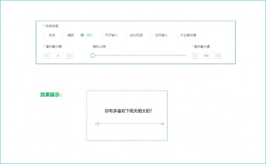

#### 文字输入

#### 鼠标轨迹

#### 语音输入

#### 不设置按键

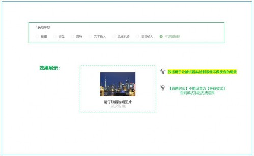

### 是否反馈反应时长

#### 有反馈实验的逻辑设置

#### 无反馈实验的逻辑设置

### 设置实验逻辑（仅针对于有反馈实验）

#### 根据反应时长反馈

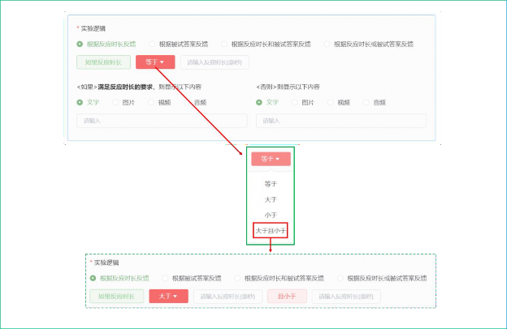

#### 根据被试答案反馈

#### 根据反应时长和被试答案反馈

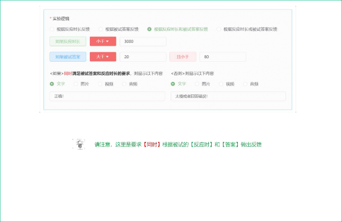

#### 根据反应时长或被试答案反馈

### 编辑、增加、删除试次

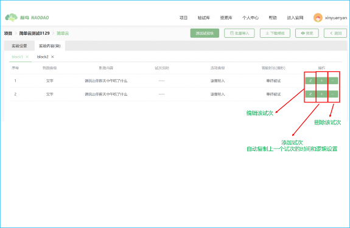

## 批量设置实验——导入实验模板

当试次过多的时候，手动一个一个设置会比较费时间。简单云为大家提供一个可以快速设置多试次的方式，即
（1）先点击【下载模板】；
（2）设置模板内的参数之后，点击【批量导入】，即生成实验。

下载下来的模板名字为： `exp_template.xls`

表格中的每一栏有详细的提示说明。

唯一一处需要在此处说明的是，关于图片、视频、音频的 URL 地址问题。

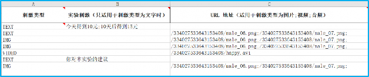

从上图的第 C 列可以看出，会有一串关于该图片（或者视频、音频）的独特编码。那么这个独特编码是如何获取的呢？方法很简单，如下所示：

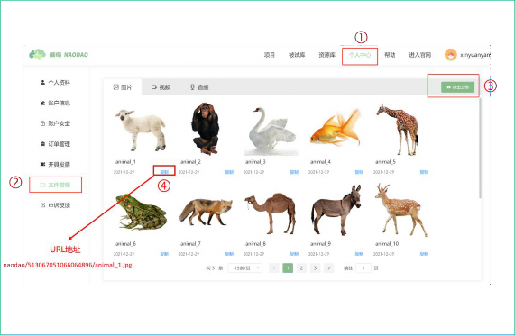
